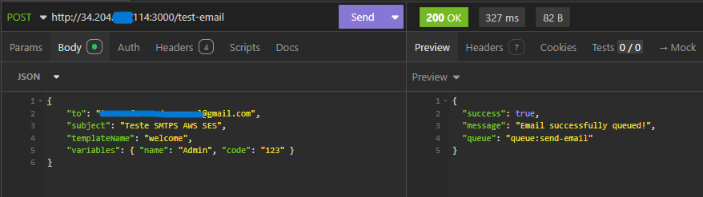
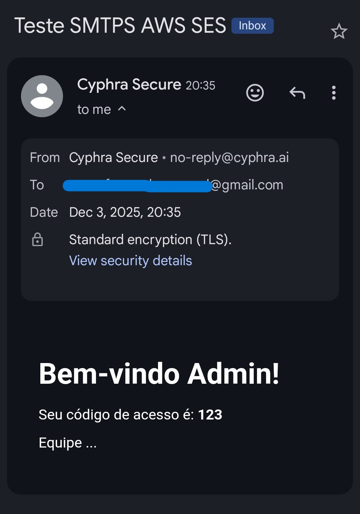

# E-Mail Worker

*Criação de um simples worker que foca no máximo de desempenho com o mínimo de consumo de recursos.*

## Resumo da Arquitetura de E-Mails Assíncrono

O objetivo é remover a carga de processamento de e-mails (montagem de HTML e conexão SMTP) da sua aplicação/instâncias, delegando isso para um "Worker" leve e barato. Isso evita um maior peso na build e processamento desnecessário nas instâncias\!

Muito mais barato que depender de um RabbitMQ, sendo planejado para ter o menor gasto possível e ser capaz de rodar em instâncias micro, sem problemas.

Não é a melhor opção para e-mails diversos (marketing massivo), mas atende perfeitamente a necessidade de e-mails transacionais de projetos.

-----

## Features

  - Fila de e-mails com redis, servindo de *Message Broker*.

  - **Sistema de Retry & Dead Letter Queue (DLQ)** para garantir entrega.

  - Templates personalizados com *Handlebars*, permitindo o envio de vários e-mails diferentes, com dados diferentes, mas com o mesmo código.

  - Envio via *AWS SES* (dependendo da sua necessidade, pode ser via nodemailer).

-----

## Fluxo de Dados + Case

1.  **Gatilho (Spring Boot):** O usuário realiza uma ação (ex: Cadastro). O Spring Boot monta um objeto simples (DTO) contendo apenas os dados brutos (Nome, Link, Tipo do E-mail) e o serializa para JSON.



2.  **Fila (Redis):** O Spring envia esse JSON para uma lista no Redis (`queue:send-email`) usando o comando `LPUSH`. A operação leva milissegundos. O Spring volta a atender o usuário imediatamente.

3.  **Consumidor (Node.js Worker):** Script leve rodando na instância auxiliar monitora a fila usando `BLPOP` (Bloqueio inteligente). Assim que o JSON chega, o Node captura.

4.  **Processamento (Node + Handlebars):** O script identifica qual template usar (ex: `welcome.hbs`), carrega o arquivo e substitui as variáveis pelos dados do JSON.

5.  **Envio (AWS SES):** Node conecta no SMTP da Amazon e despacha o HTML finalizado.



**NOTA:** - É interessante utilizar um *AWS Secret Manager* ou *Parameter Store* para as keys\!
\- O Worker não cuida da validação dos dados, apenas formata e lança para o envio\!

-----

## Resiliência e Dead Letter Queue (DLQ)

Para garantir que nenhum e-mail seja perdido em caso de instabilidade (ex: AWS SES fora do ar ou credenciais expiradas), o sistema implementa um mecanismo de tolerância a falhas.

### 1\. Mecanismo de Retry (Backoff)

Se o envio falhar, o worker não descarta a mensagem:

  * O worker decrementa um contador de tentativas (`attempts`, padrão: 3).
  * Aplica um atraso de 5 segundos (*backoff*).
  * Reinsere a mensagem no final da fila principal (`queue:send-email`) para nova tentativa.

### 2\. Dead Letter Queue (O Cemitério)

Se após 3 tentativas o envio continuar falhando, a mensagem é movida para uma fila separada de "Cartas Mortas".

  * **Key Principal:** `queue:send-email`
  * **Key DLQ:** `queue:send-email:dlq`

Isso evita que um e-mail com erro trave o processamento dos demais (Head-of-Line Blocking) e permite análise posterior.

### 3\. Recuperação (Replay)

Após corrigir o problema (ex: renovar a senha do SMTP), é possível reprocessar as mensagens falhas executando o script com a flag de retry:

```bash
node index.js --retry-dlq
```

*Este comando move os itens da DLQ de volta para a fila principal.*

-----

### Infraestrutura Econômica (Instância Auxiliar)

Uma única instância **AWS t4g.nano** (2 vCPU, 500MB RAM - \~$2.70/mês), consegue rodar dois serviços críticos simultaneamente:

  * **Redis Server:**

      * **Função:** Cache de Rate Limit (Bucket4j) + Fila de E-mails + DLQ.
      * **Configuração:** Protegido por senha (`requirepass`), bind apenas local, persistência **AOF** ativada (para não perder a DLQ em reboot).
      * **Consumo:** \~30MB a 60MB RAM.

  * **Node.js Email Worker:**

      * **Função:** Ler Redis, renderizar HTML, enviar SMTP, gerenciar Retries.
      * **Gerenciador:** **PM2** (Mantém o processo vivo, reinicia se cair, limita memória).
      * **Consumo:** \~40MB a 80MB RAM.

**Sobra de Recursos:** \~350MB de RAM livres para o Sistema Operacional e buffers de rede. Seguro e estável.

-----

### Stack

| Componente | Tecnologia | Motivo da Escolha |
| :--- | :--- | :--- |
| **Broker** | **Redis (Listas)** | Latência zero, persistência em disco (AOF), suporte a atomicidade. |
| **Worker** | **Node.js** | Baixíssimo consumo de memória, I/O não bloqueante perfeito para redes. |
| **Templates** | **Handlebars (.hbs)** | Simples, lógica separada do layout, fácil manutenção dos arquivos HTML. |
| **Envio** | **Nodemailer** | Biblioteca padrão da indústria JS para SMTP. |
| **Provedor** | **AWS SES** | Custo irrisório ($0.10/1000 emails) e alta entregabilidade. |

-----

### Estrutura do Payload (JSON no Redis)

*Exemplo do payload que transita entre a aplicação e o worker. O campo `attempts` é gerenciado automaticamente pelo worker se não for enviado.*

```json
{
  "to": "usuario@exemplo.com",
  "subject": "Bem-vindo",
  "templateName": "welcome", 
  "attempts": 3,
  "lastError": "Connection timeout...",
  "variables": {
    "name": "Fulano Silva",
    "confirmationLink": "https://<domain>/confirm?token=xyz",
    "year": 2025
  }
}
```

-----

### Vantagens Estratégicas

1.  **Segurança (Zero Bloqueio):** Se a AWS SES ficar lenta ou cair, sua aplicação/instâncias **não travam**. O e-mail fica guardado no Redis até o serviço voltar.

2.  **Manutenção de Layouts:** Se você quiser mudar a cor do botão do e-mail ou corrigir um texto, você edita o arquivo `.hbs` na instância do worker. Não precisa recompilar nem redeployar o Backend Java.

3.  **Elasticidade:** Se a aplicação/instâncias escalar para 10 máquinas, todas jogam mensagens no mesmo Redis. O Worker processa uma por uma na ordem de chegada.

4.  **Custo:** Transformamos um recurso que já pagaria (Redis) em um sistema de mensageria completo com tolerância a falhas, economizando a criação de um RabbitMQ ou de mais máquinas Java.

**NOTA:** Reforçando, apenas é interessante manter esse sistema, caso a demanda não seja tão elevada (Milhões de e-mails/dia)\! Essa aplicação evita gastos desnecessários com recursos overkills (RabbitMQ, etc...) e aproveita a mesma instância que gerenciamos os tokens de refresh para criar um message broker eficiente.
